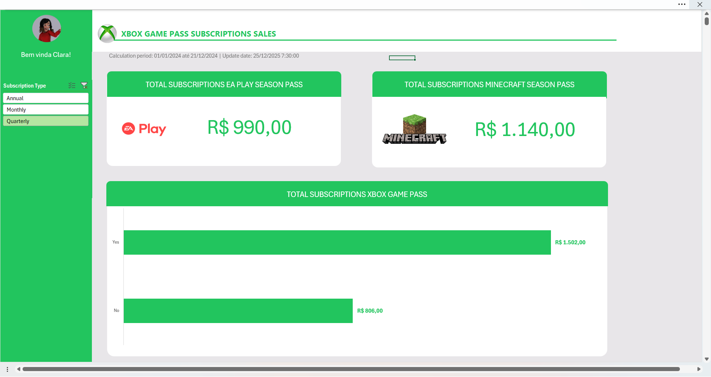

# xbox-sales-dashboard
Dashboard de vendas de assinaturas feito em Excel

# 🎮 Dashboard de Vendas de Assinaturas - Xbox Game Pass

## 📋 Sobre o Projeto
Este projeto apresenta um dashboard interativo desenvolvido para analisar a performance de vendas de assinaturas do ecossistema Xbox (Game Pass, EA Play e Minecraft). O objetivo foi criar uma visualização clara para monitoramento de KPIs e tomada de decisão estratégica.

**Contexto:** Simulação de dados de vendas para o período de 01/01/2024 a 21/12/2024.

## 📊 Funcionalidades e Insights
O painel permite a visualização rápida de:
* **Receita Total por Produto:** Acompanhamento individual de EA Play (R$ 990,00) e Minecraft Season Pass (R$ 1.140,00).
* **Comparativo de Vendas:** Gráfico de barras comparando status de assinaturas do Xbox Game Pass.
* **Filtros Dinâmicos:** Segmentação por tipo de assinatura (Anual, Mensal, Trimestral) para análises granulares.
* **Interface Intuitiva:** Design inspirado na identidade visual do Xbox para imersão do usuário.

## 🛠️ Ferramentas Utilizadas
* **Microsoft Excel:** Criação da base de dados, Tabelas Dinâmicas (Pivot Tables) e Segmentação de Dados (Slicers).
* **Design de Dashboard:** Uso de formas e formatação condicional para criar uma interface semelhante a um aplicativo.

## 🚀 Como visualizar
1. Faça o download do arquivo `Dashboard_Xbox.xlsx` neste repositório.
2. Abra o arquivo no Microsoft Excel.
3. Utilize os filtros laterais para interagir com os gráficos.

---
*Projeto desenvolvido como parte do curso de Análise de Dados com Python da [Nome da Escola/Curso].*
